# Natively — Architecture Deep Dive (Engineering Reference)

> **Status:** Reverse-engineered from the source in this repository on **2026-05-30** (v2.7.0).
> **Important:** The `README.md` is marketing/SEO-oriented and **overstates** several capabilities.
> Everything in this document was verified against the actual code, with `file:line` references.
> Where the README and the code disagree, **this document describes what the code does.**

This is the document to read if you want to know *how Natively actually works* — the audio
pipeline, the screen/vision pipeline, the intelligence (transcript→answer) pipeline, the local
RAG store, the resilience machinery, licensing, platform support, and how to build/run it
(especially on Windows).

**See also:**
- 📊 **[docs/diagrams/](docs/diagrams/README.md)** — all 12 diagrams below as standalone, rendered
  Mermaid (with `.mmd` sources + SVG/PNG render scripts).
- 🛠️ **[docs/runbook/AUDIO_TROUBLESHOOTING.md](docs/runbook/AUDIO_TROUBLESHOOTING.md)** — operator
  triage for "audio went silent / nothing is transcribing".

---

## Table of Contents

1. [What Natively is](#1-what-natively-is)
2. [Quick-answer FAQ](#2-quick-answer-faq)
3. [Process & window model](#3-process--window-model)
4. [Audio capture + dual-channel STT](#4-audio-capture--dual-channel-stt)
5. [The "Speaker Diarization" reality](#5-the-speaker-diarization-reality)
6. [STT resilience / failover / reconnect](#6-stt-resilience--failover--reconnect)
7. [Screen capture / vision / OCR pipeline](#7-screen-capture--vision--ocr-pipeline)
8. [Live intelligence pipeline (transcript → answer)](#8-live-intelligence-pipeline-transcript--answer)
9. [Intent classifier + planner internals](#9-intent-classifier--planner-internals)
10. [Local memory / RAG / persistence](#10-local-memory--rag--persistence)
11. [Providers, models & API keys](#11-providers-models--api-keys)
12. [Modes / personas / reference files](#12-modes--personas--reference-files)
13. [Licensing / Pro gating (and the stripped premium module)](#13-licensing--pro-gating)
14. [Sequence diagrams](#14-sequence-diagrams)
15. [Platform support matrix](#15-platform-support-matrix)
16. [Running this repo as-is](#16-running-this-repo-as-is)
17. [Windows dev setup — step by step](#17-windows-dev-setup--step-by-step)
18. [Key gotchas & caveats](#18-key-gotchas--caveats)
19. [Source file reference index](#19-source-file-reference-index)

---

## 1. What Natively is

A **Cluely-style invisible desktop copilot** built with **Electron + React/Vite + TypeScript**, plus a
**Rust native module** (NAPI-RS) for low-latency audio capture and OS-level stealth. During a live
meeting/interview it:

1. Captures **two audio channels** — the meeting's **system audio** and your **microphone** — and
   transcribes both in real time via a configurable STT provider.
2. Runs an **intent classifier + planner** to decide whether the latest speech warrants a response,
   then **streams an AI suggestion** into an always-on-top translucent overlay.
3. Can **screenshot the screen on demand** and analyze it with a vision LLM (e.g. a LeetCode problem).
4. Stores meetings locally in **SQLite + a `sqlite-vec` vector index** for local RAG ("what did John say
   about the API last week?").

Everything runs locally except calls to whichever **cloud STT/LLM provider** you configure (you can go
fully local with Ollama + local Whisper).

---

## 2. Quick-answer FAQ

| Question | Answer | Evidence |
|---|---|---|
| **Must the captured screen be static?** | **Yes** — a still PNG is sent to a vision model. No live/video understanding. | `ScreenshotHelper.ts:141` (`desktopCapturer.getSources({types:['screen']})`) |
| **Does it recall past screens, or must the screen be open at the right moment?** | **Right moment.** Manual hotkey capture; no continuous buffering. A small working queue of **≤5** recent shots is kept on disk for the current analysis, then deleted. No long-term screen memory. | `ScreenshotHelper.ts` (`MAX_SCREENSHOTS = 5`, queue evict/clear) |
| **Does it take several screenshots?** | **Yes, up to 5** (e.g., multi-part problems). Oldest auto-evicted (FIFO). | `ScreenshotHelper.ts` queues |
| **How is capture triggered?** | Global hotkeys: `Cmd/Ctrl+H` (capture to queue), a capture-and-process hotkey (`Cmd+Shift+Enter`), and a region-crop mode. | `main.ts:665–699`, `main.ts:4304` |
| **Do I get Speaker Diarization out of the box?** | **No.** Not implemented anywhere — it is a README marketing claim. You get **2-channel attribution**: system audio → `interviewer`, mic → `user`. | `main.ts:1421–1447`; repo grep for "diariz" |
| **Does audio transcription work on Windows?** | **Yes** — system audio via **WASAPI loopback**, mic via **CPAL** — *but only if the Rust native module is compiled* (no prebuilt binary ships in the repo). | `native-module/src/speaker/windows.rs`, `Cargo.toml:46–49` |
| **Does diarization work on Windows?** | **No — it doesn't work on any platform.** | feature absent in code |

---

## 3. Process & window model

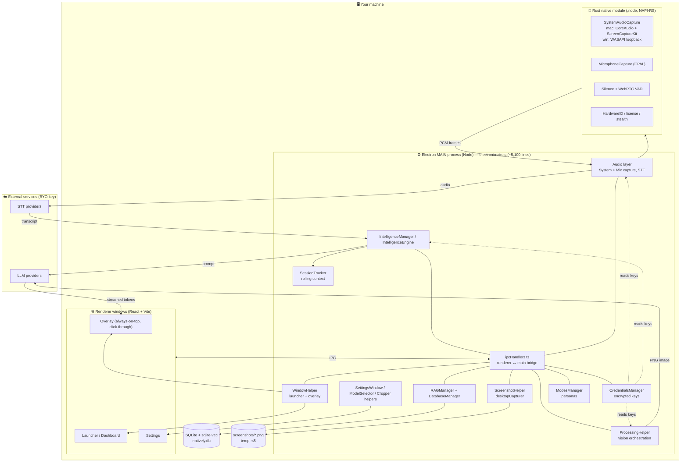

**Windows (BrowserWindows):**

| Window | Helper | Purpose | Lifecycle |
|---|---|---|---|
| **Overlay** | `WindowHelper.ts` | The always-on-top, translucent, click-through intelligence overlay (live answers). ~780px wide. Content-protected (hidden from screen-share). | Pre-created hidden at boot; shown on meeting start |
| **Launcher / Dashboard** | `WindowHelper.ts` | Start screen + full meeting history/management dashboard | Toggled with overlay via `Cmd/Ctrl+B` |
| **Settings** | `SettingsWindowHelper.ts` | API keys, model & STT/TTS selection, privacy controls | Preloaded off-screen for instant open |
| **Model selector** | `ModelSelectorWindowHelper.ts` | Quick model-switch dropdown | Preloaded off-screen |
| **Cropper** | `CropperWindowHelper.ts` | Full-screen region-selection overlay for selective screenshots | Preload + reuse (hide, not close) |

Global shortcuts are registered in `main.ts` (toggle `Cmd/Ctrl+B`; screenshot `Cmd/Ctrl+H`; capture-and-process; focus input; scroll binds). The app also has a tray icon and a "process disguise"/stealth posture (macOS-strongest).

---

## 4. Audio capture + dual-channel STT

This is the core of the product and the part most relevant to the Windows/diarization questions.

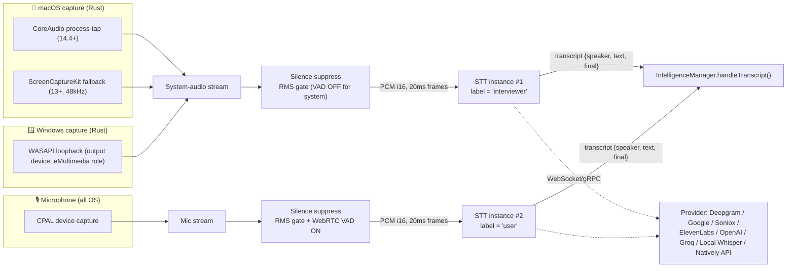

**Native capture backends** (Rust, `native-module/src/speaker/`):

- **macOS:** `core_audio.rs` (CoreAudio process-tap, macOS 14.4+) with `sck.rs` (ScreenCaptureKit, macOS 13+, hardcoded 48kHz mono) as fallback. Mic via CPAL (`microphone.rs`).
- **Windows:** `windows.rs` — **WASAPI loopback** on the default render/output device (eMultimedia/eConsole role; *not* eCommunications — a known limitation noted in code). Mic via CPAL.
- **Linux:** `mod.rs` fallback stub whose `SpeakerInput::new()` **always errors** (`mod.rs:42`). Mic via CPAL works, but there is no system audio.

**DSP & framing** (Rust, `silence_suppression.rs`, `audio_config.rs`): native rate (typically 48kHz) → f32→i16, **20ms frames**, batched up to 3 frames per NAPI call (zero-copy via `bytemuck`/`napi::Buffer`). Two-stage gating: **RMS volume gate** + **WebRTC VAD** — VAD is **disabled for system audio** (so music/video isn't suppressed) and **enabled for the mic**. Keepalive silence frames every ~100ms keep STT stream timing alive.

**Dual channel = "speaker" attribution.** `main.ts` constructs **two STT instances**: one for `interviewer` (system audio) and one for `user` (mic). The `speaker` field is just *which channel produced the audio* — see [§5](#5-the-speaker-diarization-reality).

**Native module loading** (`electron/audio/nativeModuleLoader.ts`): maps platform/arch → binary name (e.g. `index.win32-x64-msvc.node`, `index.darwin-arm64.node`), loads the `.node` directly (bypassing npm symlinks, which break on Windows), validates required exports, and runs a smoke test (`getInputDevices()`). **Returns `null` on failure → graceful degradation** (empty device list, system-audio `start()` emits an error). There are **no prebuilt `.node` files in the repo** — see [§16](#16-running-this-repo-as-is).

---

## 5. The "Speaker Diarization" reality

> **Out of the box you get *channel separation*, not diarization.**

- Natively runs **two independent transcribers** (system audio + mic). Every transcript line is tagged
  `interviewer` (anything from the meeting/your speakers) or `user` (your mic) — `main.ts:1421–1447`.
- In a **1-on-1 call** this *looks* like diarization. In a **multi-person room** on the far end, all of
  their voices arrive on system audio and collapse into a single `interviewer` — there is **no per-voice
  identification**.
- **No `diarize: true` / `enableSpeakerDiarization` / `speaker_labels` flag is sent to any provider**
  (Deepgram, Google, and Soniox all support diarization; the code never enables it).
- `LocalWhisperSTT.ts:6` says it plainly: *"No diarization model is needed; speaker attribution is free
  from the hardware."*
- A repo-internal doc (`comparisonreport.md:693`) lists *"No speaker identification in transcript … no
  diarization"* as a **Product gap (P2)**, and a test checklist literally says *"verify diarization (if
  implemented)"*.

**Verdict:** README claims (✅ "Speaker Diarization", *"tags individual speakers by name"*) are **not backed
by any code in this repo**, on any platform. The premium gating tables also list it as Pro-only, but no
diarization code exists in either the open-source tree or the gating logic.

---

## 6. STT resilience / failover / reconnect

The streaming providers are individually **hardened** against dropped sockets, DNS flaps, and the
infamous **1006 reconnect storm**. The mechanism is **per-provider reconnect**, *not* the
"round-robin connection pools / shadow-probe failover" the README describes (that, if it exists, is
**server-side** in the hosted Natively API — it is **not** in this client).

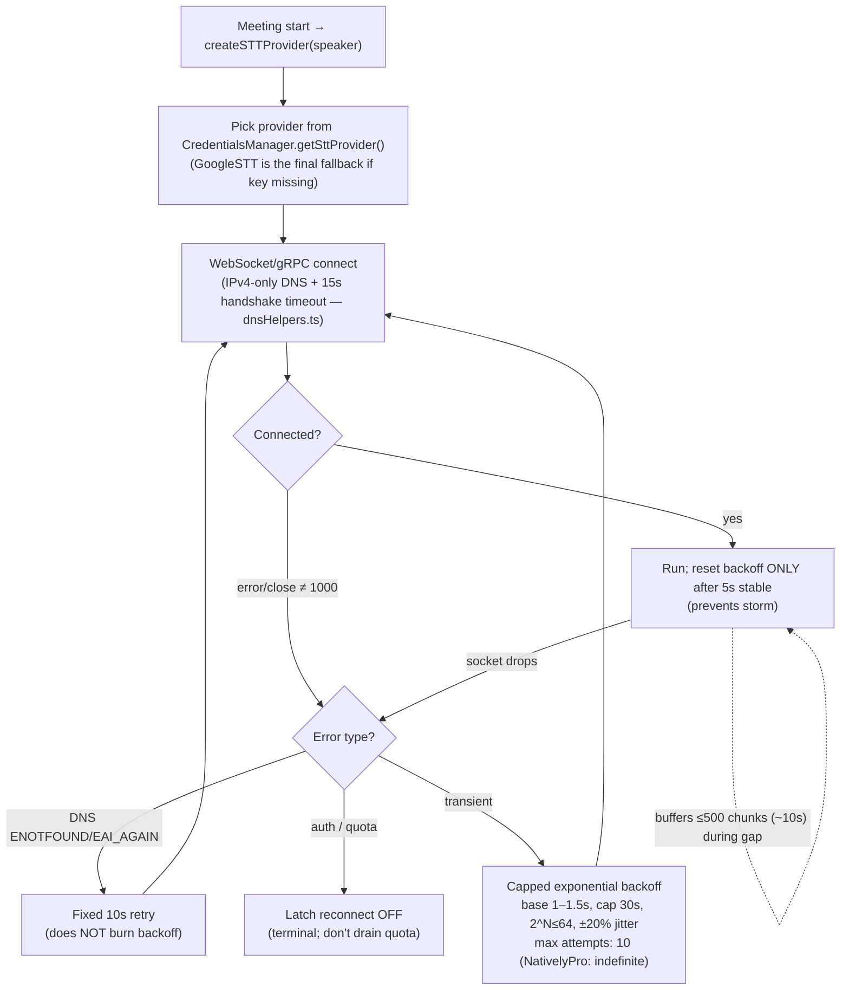

**Cross-cutting resilience (all verified in code + pinned by tests):**

| Mechanism | Where | Notes |
|---|---|---|
| Capped exponential backoff + jitter | NativelyProSTT, Deepgram, ElevenLabs, Soniox, OpenAI | base 1–1.5s, cap 30s; jitter prevents thundering herd |
| Stability timer (reset backoff only after 5s stable) | NativelyProSTT, Deepgram | the key anti-"1006 storm" guard |
| DNS-specific retry (10s fixed, no backoff burn) | NativelyProSTT + `dnsHelpers.ts` | classifies `ENOTFOUND`/`EAI_AGAIN` |
| Auth/quota errors are terminal | ElevenLabs, NativelyPro | latches reconnect off so it doesn't burn quota |
| Audio buffering during reconnect (≤500 chunks ≈10s) | most streaming providers | overflow drops oldest + emits `buffer-overflow` |
| Keepalive pings | Deepgram (8s), Soniox (5s), OpenAI (20s) | keeps sockets warm |
| IPv4-only DNS + 15s handshake cap | `dnsHelpers.ts` | dodges link-local IPv6 stalls |
| Orphan-timer cleanup on close | NativelyPro `closeUpstream()` | clears reconnect/stability/pending timers |
| Stuck-capture watchdog (8s no chunks → UI banner) | `main.ts` wireSystemCapture/wireMicCapture | disarmed *before* stop/destroy to avoid false alarms |
| Output-device-change recovery + cross-flow mutex | `main.ts` handleDefaultOutputChanged ↔ error listener | follows headphone/AirPods switches without orphaning the old capture |
| Capture restart correctness (null native ref after deferred stop) | SystemAudioCapture / MicrophoneCapture | prevents silent "no audio on 2nd meeting" bug |
| OpenAI WS→REST fallback | OpenAIStreamingSTT | `gpt-4o-transcribe` → mini → REST `whisper-1` |

**Important nuance — there is *no* mid-meeting cross-provider failover.** The provider is chosen **once at
meeting start** from your configured `sttProvider` (with `GoogleSTT` as the only static fallback if a key
is missing). A failing provider **reconnects to itself**; it does not hand off to a different provider
mid-session.

**Resilience that is NOT in the client** (README overclaim): round-robin connection **pools**, and
**shadow-probe** failover. Not present in `electron/`.

**Tests double as the spec** (`electron/audio/__tests__/`): `ReconnectStormCap`, `NativelyProSTTDnsErrorSchedulesReconnect`,
`NativelyProSTTDnsRetryStatus`, `NativelyProSTTStaggerTimer`, `NativelyProSTTCloseUpstreamTimers`,
`NativelyProSTTPendingTimer`, `DeepgramStabilityTimerTracked`, `CaptureRestartRegression`,
`SystemAudioRecoveryRouteChangeMutex`, `StuckWatchdogDisarmOnEndAndAbort`, `RestSttSafetyNetGate`. These pin the
exact invariants above so a future refactor that breaks them fails CI.

---

## 7. Screen capture / vision / OCR pipeline

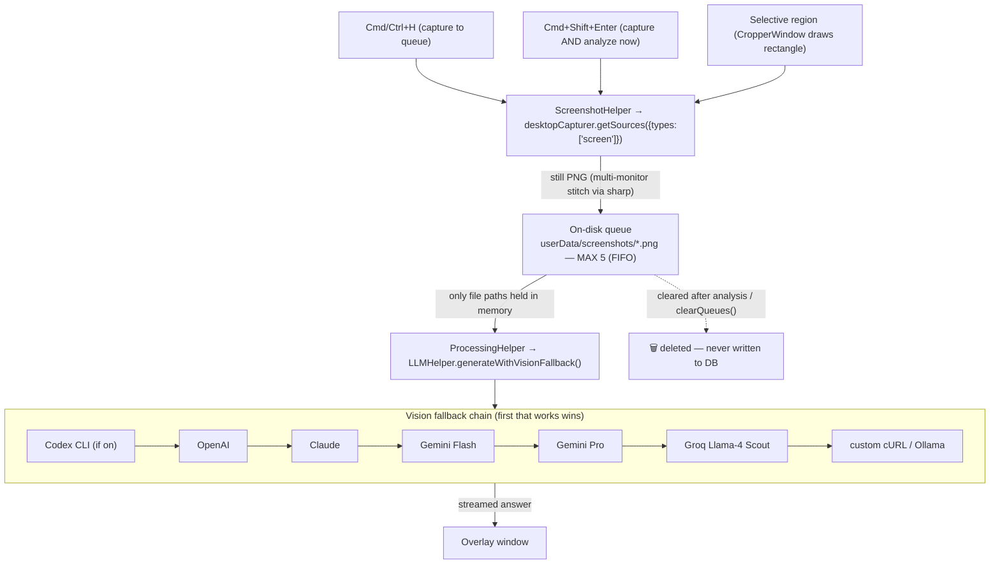

**Answers to the core questions:**

- **Static?** Yes — a frozen **PNG**, captured at the instant you press the key. The model never sees a
  live feed.
- **Recall past screens?** No. Beyond the small ≤5 working queue, nothing is retained. Screenshots are
  **temp files, never persisted to the meetings database**, and are deleted after use.
- **Several?** Yes — up to **5** can be stacked into one analysis (multi-part problems); oldest evicted.
- **Trigger?** Manual hotkeys only — no continuous/automatic capture, no screen buffering.
- **OCR?** It is **vision-first, not OCR-first.** `tesseract.js` is a dependency and a code path exists,
  but the default flow sends the **raw image straight to a vision LLM**. (Repo docs describe a deliberate
  "vision-first pivot".) The `screenshot-desktop` npm dep is present but **not imported anywhere** —
  capture uses Electron's `desktopCapturer`, which is cross-platform (Windows + macOS; Linux uses shell
  fallbacks).
- **Cropper:** full-screen transparent window; user drags a rectangle; multi-display selections are
  cropped per-display and composited with `sharp` (DPI-aware). Windows uses an opacity-shield sequence to
  avoid DWM frame leakage; macOS uses NSPanel stealth to avoid stealing focus.

---

## 8. Live intelligence pipeline (transcript → answer)

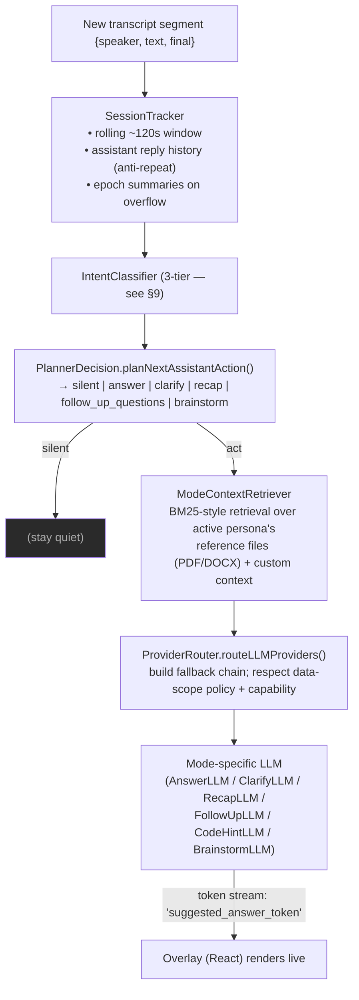

The notable design point: Natively **doesn't answer every sentence.** An intent classifier + a planner
decide whether the latest speech is actually a question worth answering, so the overlay stays quiet during
normal back-and-forth and only fires when warranted.

Per-turn LLMs live in `electron/llm/`: `AnswerLLM`, `AssistLLM`, `ClarifyLLM`, `RecapLLM`, `FollowUpLLM`,
`FollowUpQuestionsLLM`, `CodeHintLLM`, `BrainstormLLM`, plus `ConversationSummarizer` (epoch summaries) and
`GeminiPromptCache` (prompt caching for Gemini).

---

## 9. Intent classifier + planner internals

### 9.1 IntentClassifier (`electron/llm/IntentClassifier.ts`)

A **3-tier** classifier that maps the last interviewer turn to one of 8 intents, each carrying an
**answer shape** (instructions injected into the prompt to control *how* the answer is structured):

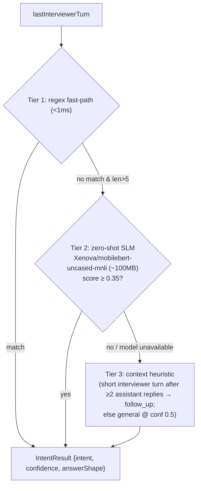

- **Intents:** `clarification`, `follow_up`, `deep_dive`, `behavioral`, `example_request`, `summary_probe`,
  `coding`, `general`.
- **Tier 1 (regex):** instant patterns, e.g. coding is matched by a broad regex
  (`write code|implement|algorithm|refactor|optimize|boilerplate|component for|logic for|…`), confidence ~0.9.
- **Tier 2 (SLM):** lazy-loaded `@huggingface/transformers` zero-shot pipeline using
  `Xenova/mobilebert-uncased-mnli`. Packaged builds read the model from `process.resourcesPath/models`
  (no network); dev can download from HF Hub. **Confidence threshold 0.35**; below that it returns null and
  falls through. Can be warmed up at boot (`warmupIntentClassifier()`).
- **Tier 3 (heuristic):** pure context fallback so the system never blocks on the model.
- **Answer shapes** are notable for the "human persona" design — e.g. `behavioral`/`example_request`
  explicitly forbid inventing names/companies/metrics unless grounded context exists, and `coding` demands a
  full runnable implementation. This is the anti-"robotic chatbot" guardrail.

### 9.2 PlannerDecision (`electron/llm/PlannerDecision.ts`)

A deterministic decision tree turning intent + context into one action:

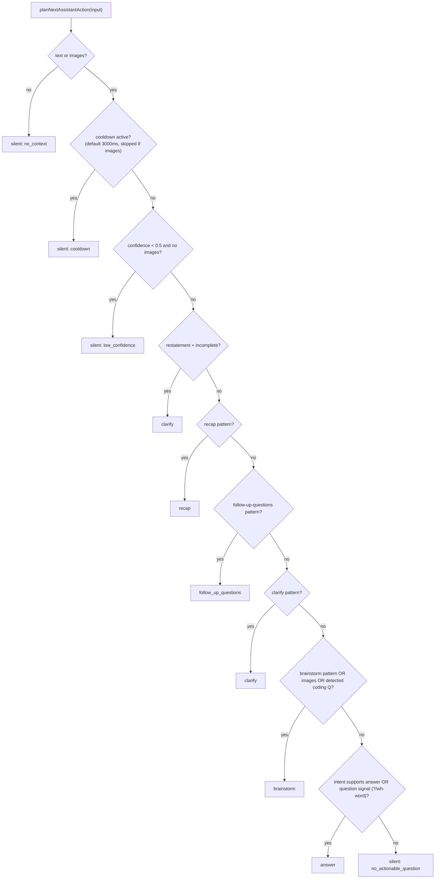

Key thresholds: **confidence gate `< 0.5` → silent**; **default cooldown 3000ms** between triggers (both
bypassed when a screenshot/image is present, since a captured problem is always actionable).

---

## 10. Local memory / RAG / persistence

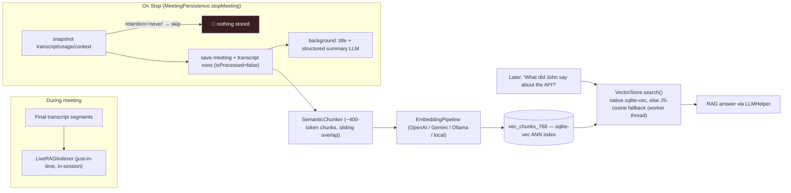

- **Store:** `natively.db` (better-sqlite3) with tables `meetings`, `transcripts`, `chunks`,
  `vec_chunks_768` (vector index), `chunk_summaries`, `embedding_queue`, `ai_interactions`.
- **Vector search:** `sqlite-vec` native extension, loaded from the **unpacked asar**; if unavailable it
  **falls back to JS cosine similarity** in a worker thread (`VectorStore.ts`). *(Relevant on Windows —
  see [§18](#18-key-gotchas--caveats).)*
- **Rolling context:** `SessionTracker` keeps ~120s of transcript plus assistant-reply history; on overflow
  it compacts into **epoch summaries** rather than hard-truncating.
- **Privacy:** `meetingRetention: 'never'` skips persistence entirely; there is also a per-meeting
  do-not-persist flag.

---

## 11. Providers, models & API keys

**LLM providers** (`electron/llm/ProviderRouter.ts`, `LLMHelper.ts`): `natively` (hosted), `groq`, `codex`
(local CLI), `gemini_flash`, `gemini_pro`, `openai`, `claude`, `deepseek`, `ollama` (local), and **custom
cURL** endpoints. `ProviderRouter.routeLLMProviders()` builds an ordered attempt chain and marks a provider
`unavailable` if its key is missing, it lacks the needed capability (`chat`/`stream_chat`/`structured`/
`vision`), or a **data-scope policy** blocks it (scopes: `transcript`, `screenshots`, `reference_files`,
`profile_history`, `embeddings`, `post_call_summary`).

**Configured model constants** (in `LLMHelper.ts` — note these are forward-looking names baked into the
source, reported here as-is, not endorsed): `gemini-3.1-flash-lite-preview`, `gemini-3.1-pro-preview`,
`llama-3.3-70b-versatile` (Groq), `gpt-5.4` (OpenAI), `claude-sonnet-4-6` (Claude), `deepseek-v4-flash`.
`.env.example` default `DEFAULT_MODEL=gemini-3-flash-preview`.

**STT providers** (`electron/audio/*STT.ts`): Deepgram (nova-3, WS), Google (gRPC streaming, service
account), Soniox (WS, `stt-rt-v4`), ElevenLabs (WS, `scribe_v2_realtime`), OpenAI (Realtime WS + REST
`whisper-1`), Groq/Azure/IBM Watson via `RestSTT` (batch), Local Whisper (ONNX, on-device), and Natively API
(`wss://api.natively.software/v1/transcribe`).

**API keys:** stored **locally, encrypted** via `CredentialsManager` (Electron `safeStorage`); `keytar` is
also present for OS-keychain use. Keys can also be injected via `.env` in dev (see `.env.example`). Nothing
is uploaded; data leaves the machine only via the cloud provider you choose.

---

## 12. Modes / personas / reference files

`electron/services/ModesManager.ts` provides template-based personas: `general`, `looking-for-work`,
`sales`, `recruiting`, `team-meet`, `lecture`, `technical-interview` (plus user-created custom modes). Each
mode has a template prompt (sharing a common prefix to avoid token duplication), optional **custom context**
text, and optional **reference files** (PDF/DOCX parsed to text and stored in `mode_reference_files`).

At answer time, `ModeContextRetriever` does lightweight **BM25-style keyword retrieval** over the active
mode's reference chunks (≈140-word chunks, 30-word overlap; top-6, ~1800-token budget; adaptive threshold
for short pre-call queries), falling back to the custom-context field if there are no files.

> Most mode/persona richness (and reference-file ingestion) is **Pro-gated** — see [§13](#13-licensing--pro-gating).

---

## 13. Licensing / Pro gating

`ipcHandlers.ts` gates premium features behind `isProOrTrialActive()` = (premium license **OR** unexpired
free trial). Licensing supports **Gumroad** and **Dodo Payments** keys plus the Natively API subscription;
hardware ID + Gumroad/Dodo verification live in the **Rust native module** (`license.rs`,
`verifyGumroadKey`/`verifyDodoKey`/etc., with the Dodo functions optional so a stale binary still loads).

**Critical for this repo:** the premium implementation is **stripped from the open-source tree.** The code
`require()`s `../premium/electron/services/LicenseManager` and a `KnowledgeOrchestrator`, but **only
`electron/premium/featureGate.ts` exists here** — every such call is wrapped in `try/catch` with a
`/* premium module not available */` fallback (`ipcHandlers.ts:44–47`, `113`, `132`, `142`, `153`, …). So when
you run *this* repo:

- `isProOrTrialActive()` is effectively **false** (no LicenseManager, no trial issuance).
- **Gated/absent features:** Profile Intelligence, company research, resume/JD context, negotiation
  coaching, dynamic action cards, and the richer custom-persona gating. The **General mode and the core
  copilot work fine.**

---

## 14. Sequence diagrams

**A live question gets answered:**

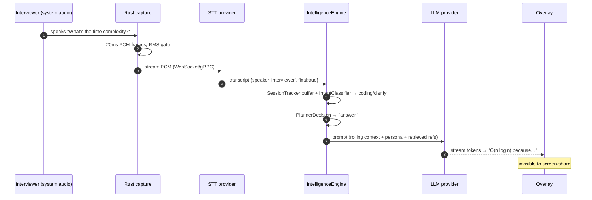

**A screenshot is analyzed:**

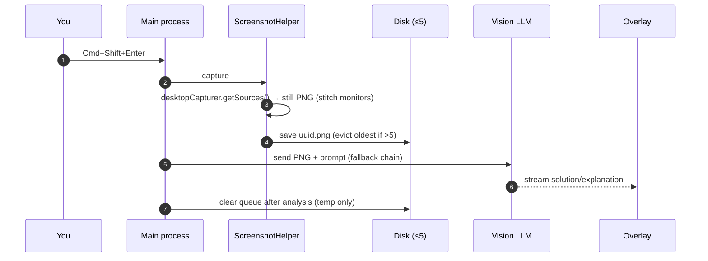

---

## 15. Platform support matrix

| Capability | macOS | Windows | Linux |
|---|---|---|---|
| System-audio capture | ✅ CoreAudio tap (14.4+) + ScreenCaptureKit fallback | ✅ **WASAPI loopback** (`windows.rs`) | ❌ stub errors (`mod.rs:42`) |
| Microphone capture | ✅ CPAL | ✅ CPAL | ✅ CPAL |
| STT (cloud + local Whisper) | ✅ | ✅ (cross-platform Node/WS) | ✅ (but no system audio to feed it) |
| **Speaker diarization** | ❌ | ❌ | ❌ |
| Screenshot / vision | ✅ `desktopCapturer` (needs Screen Recording perm) | ✅ `desktopCapturer` | ⚠️ shell-tool fallback |
| `sqlite-vec` native vector index | ✅ (darwin pkgs force-installed) | ⚠️ may fall back to JS cosine | ⚠️ depends on base pkg |
| Stealth keyboard tap / process disguise | ✅ (CGEventTap, NSPanel) | ⚠️ partial | ❌ |

**Bottom line for Windows:** audio transcription is genuinely supported (WASAPI + CPAL) and all cloud
STT/LLM SDKs are cross-platform; the only platform constraint is the native **capture** layer, which *does*
implement Windows. Diarization is unavailable everywhere.

---

## 16. Running this repo as-is

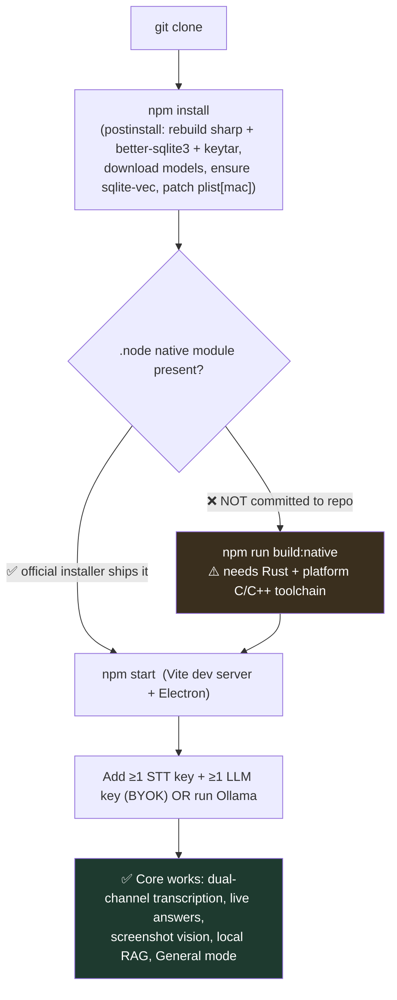

Three things that surprise people running the open-source repo directly:

1. **You must compile the Rust native module yourself** — no prebuilt `.node` is committed.
   `npm install`'s **postinstall does *not* build it**; run `npm run build:native` separately. Without it,
   `loadNativeModule()` returns `null` → no audio devices and **system-audio/mic capture won't work**.
   The downloadable installers from GitHub Releases *do* include the compiled binary.
2. **Premium features are stripped** (see [§13](#13-licensing--pro-gating)). They degrade gracefully to no-ops.
3. **BYOK** — nothing transcribes/answers until you add at least one STT key + one LLM key (or use Ollama +
   local Whisper).

---

## 17. Windows dev setup — step by step

**Prerequisites**

| Tool | Why | Notes |
|---|---|---|
| **Node.js 20+** | Electron/Vite build | — |
| **Rust** (via `rustup`) | builds the native audio module | default toolchain `stable-x86_64-pc-windows-msvc` |
| **Visual Studio Build Tools** (Desktop C++ workload, incl. Windows SDK) | required by *both* `napi build` (MSVC target) **and** `electron-rebuild` of `better-sqlite3`/`keytar` (node-gyp) | the most common source of failure if missing |
| **Python 3** | node-gyp dependency for `electron-rebuild` | — |
| **Git** | clone | — |

> The native module's Windows dependencies are declared in `native-module/Cargo.toml:46–49`
> (`wasapi = "0.13"`, `windows = "0.52"`). `cpal` (mic) and `webrtc-vad` are cross-platform.

**Steps**

```powershell
# 1. Clone
git clone https://github.com/Natively-AI-assistant/natively-cluely-ai-assistant.git
cd natively-cluely-ai-assistant

# 2. Install JS deps. postinstall will:
#    - rebuild sharp, electron-rebuild better-sqlite3 + keytar  (needs MSVC + Python)
#    - download local models (scripts/download-models.js)
#    - ensure-sqlite-vec.js (darwin-only pkgs; harmless no-op/warn on Windows)
#    - patch-electron-plist.js (macOS-only; no-op on Windows)
npm install

# 3. Build the Rust native module → produces native-module/index.win32-x64-msvc.node
#    (build-native.js runs `npx napi build --platform --release` and verifies the artifact)
npm run build:native

# 4. Provide credentials: either create .env (see .env.example) or add keys in the
#    in-app Settings window after launch.

# 5. Run (concurrently starts Vite on :5180 and Electron in dev)
npm start
```

**Where the native binary comes from (and why it isn't in the repo)**

The compiled module is **git-ignored** (`.gitignore:199` → `native-module/*.node`) and is **never
committed** — `git ls-files "*.node"` returns nothing. You obtain it one of two ways:

- **Build it (recommended)** — `npm run build:native` → `native-module/index.win32-x64-msvc.node`.
  Guarantees an ABI + arch match with your local Electron.
- **Extract it from the official installer** — download `Natively-Setup-<version>.exe` (or the portable
  `.exe`) from the project's **GitHub Releases** (`Natively-AI-assistant/natively-cluely-ai-assistant`; the
  README "Download Windows" badges link there). After install, the binary is a plain on-disk file — it lives
  in `asar.unpacked`, **not** inside `app.asar`, because native `.node` files can't be `dlopen`'d from inside
  an asar:
  ```
  <install dir>\resources\app.asar.unpacked\native-module\index.win32-x64-msvc.node
  # default per-user NSIS install:
  %LOCALAPPDATA%\Programs\Natively\resources\app.asar.unpacked\native-module\index.win32-x64-msvc.node
  ```
  Copy that file into your checkout's `native-module/` folder and `nativeModuleLoader.ts` will load it. It is
  built against N-API (`napi4`, ABI-stable), so it loads across Electron/Node versions — just match the
  **arch** (`index.win32-x64-msvc.node` for x64, `index.win32-ia32-msvc.node` for 32-bit). Building from
  source is cleaner and avoids ABI/arch surprises.

> That the official `.exe` bundles the binary is **inferred from the build config** (`app:build` runs
> `build:native` before `electron-builder`; `build.files` includes `native-module`;
> `asarUnpack: ["**/*.node"]`) — not from opening a published release asset. Verify via the path above after
> installing.

**Windows-specific gotchas**

- If `build:native` fails with linker errors → the **Desktop C++ workload / Windows SDK** is missing from
  Visual Studio Build Tools.
- If `npm install` fails rebuilding `better-sqlite3` or `keytar` → same toolchain/Python issue.
- `ensure-sqlite-vec.js` only force-installs **darwin** `sqlite-vec` packages and uses Unix `/tmp` + `tar`;
  on Windows it just warns. The native vector index may therefore be unavailable → `VectorStore` falls back
  to **JS cosine similarity** (RAG still works, just slower on large histories).
- `patch-electron-plist.js` is macOS-only and is a no-op on Windows.
- System audio is WASAPI loopback on the **default output device** (eMultimedia role). If you route meeting
  audio to a non-default device, capture may not follow it as cleanly as on macOS.
- Production Windows packaging is `nsis` + `portable` (`x64`, `ia32`) per `package.json build.win`.

---

## 18. Key gotchas & caveats

- **README ≠ code.** Diarization, "tags speakers by name," round-robin STT pools, shadow-probe failover,
  and several integrations (Calendar/Jira/Phone-Link/Codex) are marketing-forward and/or live behind the
  **missing premium module**. The core (audio, STT, vision, RAG, General mode) is real and solid.
- **No mid-meeting STT provider failover** — only per-provider reconnect; provider is fixed at meeting start.
- **Screenshots are ephemeral** — never written to the DB; ≤5 in a temp queue, deleted after analysis.
- **Vision-first** — Tesseract OCR exists but is bypassed; raw images go to the vision model.
- **`sqlite-vec` may be JS-fallback on Windows** (still functional).
- **Native module is mandatory for audio** and is **not** built by `npm install` — build it explicitly.
- **Forward-looking model names** (`gpt-5.4`, `claude-sonnet-4-6`, `gemini-3.1-*`) are hardcoded constants;
  they reflect the authors' intended targets, not a guarantee those endpoints resolve.

---

## 19. Source file reference index

| Area | Key files |
|---|---|
| App/window lifecycle, shortcuts, audio wiring | `electron/main.ts` |
| IPC bridge & Pro gating | `electron/ipcHandlers.ts`, `electron/premium/featureGate.ts` |
| Windows/overlay helpers | `electron/WindowHelper.ts`, `SettingsWindowHelper.ts`, `ModelSelectorWindowHelper.ts`, `CropperWindowHelper.ts` |
| Screenshot/vision | `electron/ScreenshotHelper.ts`, `electron/ProcessingHelper.ts`, `electron/LLMHelper.ts` |
| Native audio (Rust) | `native-module/src/lib.rs`, `speaker/{mod,core_audio,sck,windows}.rs`, `microphone.rs`, `silence_suppression.rs`, `vad.rs`, `license.rs`, `stealth_window.rs`, `keyboard_tap.rs`, `Cargo.toml` |
| Native loader (JS) | `electron/audio/nativeModuleLoader.ts`, `SystemAudioCapture.ts`, `MicrophoneCapture.ts`, `AudioDevices.ts` |
| STT providers | `electron/audio/{Deepgram,ElevenLabs,Soniox,OpenAI}StreamingSTT.ts`, `GoogleSTT.ts`, `RestSTT.ts`, `NativelyProSTT.ts`, `LocalWhisperSTT.ts`, `dnsHelpers.ts`, `whisper/*` |
| STT resilience tests | `electron/audio/__tests__/*` |
| Intelligence | `electron/IntelligenceEngine.ts`, `IntelligenceManager.ts`, `SessionTracker.ts`, `llm/IntentClassifier.ts`, `llm/PlannerDecision.ts`, `llm/ProviderRouter.ts`, `llm/*LLM.ts` |
| Modes/personas | `electron/services/ModesManager.ts`, `ModeContextRetriever.ts` |
| RAG/DB | `electron/db/DatabaseManager.ts`, `MeetingPersistence.ts`, RAG/VectorStore/EmbeddingPipeline modules |
| Build/setup | `scripts/build-native.js`, `download-models.js`, `ensure-sqlite-vec.js`, `patch-electron-plist.js`, `package.json`, `.env.example` |
```
