# Natively — Architecture Diagrams

Rendered, code-verified diagrams of how Natively works. Full prose in
**[../../ARCHITECTURE.md](../../ARCHITECTURE.md)**; audio triage in
**[../runbook/AUDIO_TROUBLESHOOTING.md](../runbook/AUDIO_TROUBLESHOOTING.md)**.

Each diagram below is **rendered inline** — GitHub and VS Code render `mermaid` code blocks
automatically. The matching `*.mmd` source files are next to this README so they can be edited or
exported independently.

## Rendering to SVG/PNG

The diagrams render natively in GitHub/VS Code (install the *Markdown Preview Mermaid Support* extension
in VS Code if needed). To export image files, use the helper scripts (they pull `mermaid-cli` via `npx`,
no global install):

```bash
# macOS / Linux
bash docs/diagrams/render.sh                 # -> docs/diagrams/rendered/*.svg
FORMAT=png THEME=dark bash docs/diagrams/render.sh
```
```powershell
# Windows
pwsh docs/diagrams/render.ps1                 # -> docs/diagrams/rendered/*.svg
pwsh docs/diagrams/render.ps1 -Format png -Theme dark
```

| # | Diagram | Source |
|---|---|---|
| 1 | System architecture | [`01-system-architecture.mmd`](01-system-architecture.mmd) |
| 2 | Dual-channel audio + STT | [`02-audio-stt-pipeline.mmd`](02-audio-stt-pipeline.mmd) |
| 3 | STT resilience / reconnect | [`03-stt-resilience.mmd`](03-stt-resilience.mmd) |
| 4 | Screenshot / vision pipeline | [`04-vision-pipeline.mmd`](04-vision-pipeline.mmd) |
| 5 | Live intelligence pipeline | [`05-intelligence-pipeline.mmd`](05-intelligence-pipeline.mmd) |
| 6 | Intent classifier (3-tier) | [`06-intent-classifier-tiers.mmd`](06-intent-classifier-tiers.mmd) |
| 7 | Planner decision tree | [`07-planner-decision-tree.mmd`](07-planner-decision-tree.mmd) |
| 8 | RAG / persistence lifecycle | [`08-rag-persistence.mmd`](08-rag-persistence.mmd) |
| 9 | Sequence: live question | [`09-seq-live-question.mmd`](09-seq-live-question.mmd) |
| 10 | Sequence: screenshot | [`10-seq-screenshot.mmd`](10-seq-screenshot.mmd) |
| 11 | Run this repo as-is | [`11-run-as-is.mmd`](11-run-as-is.mmd) |
| 12 | Operator: audio-silent triage | [`12-audio-silent-triage.mmd`](12-audio-silent-triage.mmd) |

---

## 1. System architecture

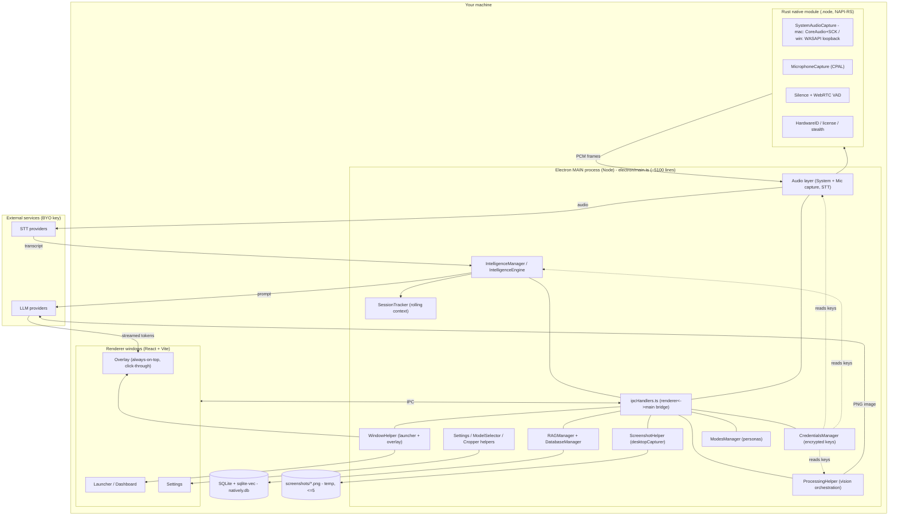

## 2. Dual-channel audio + STT

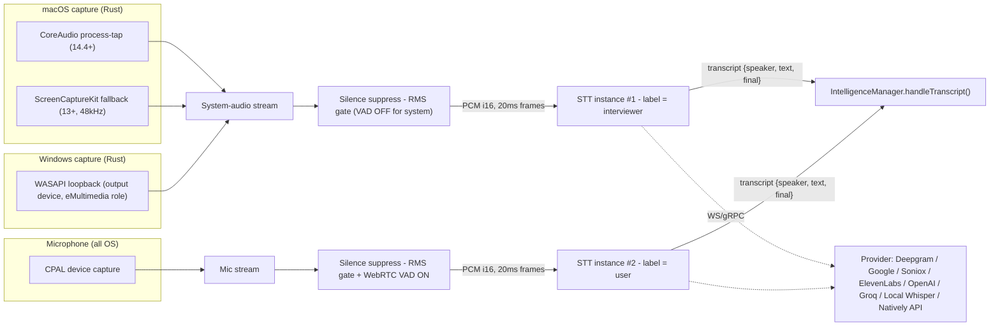

## 3. STT resilience / reconnect

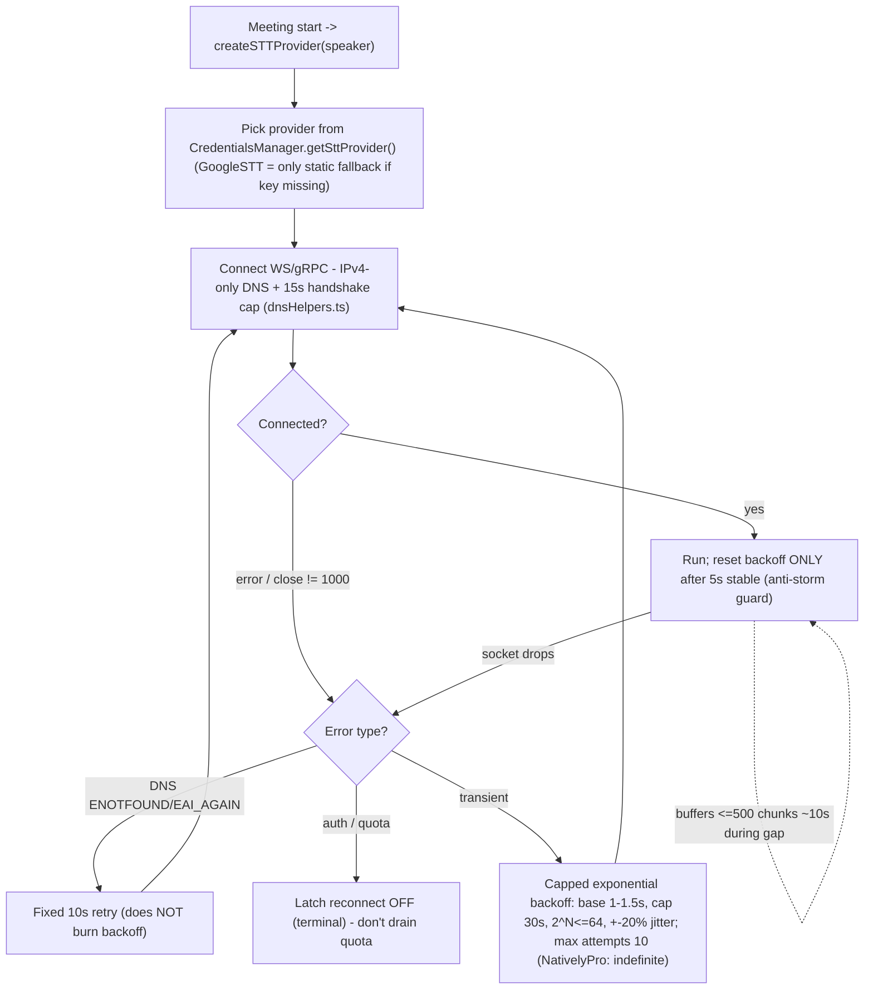

## 4. Screenshot / vision pipeline

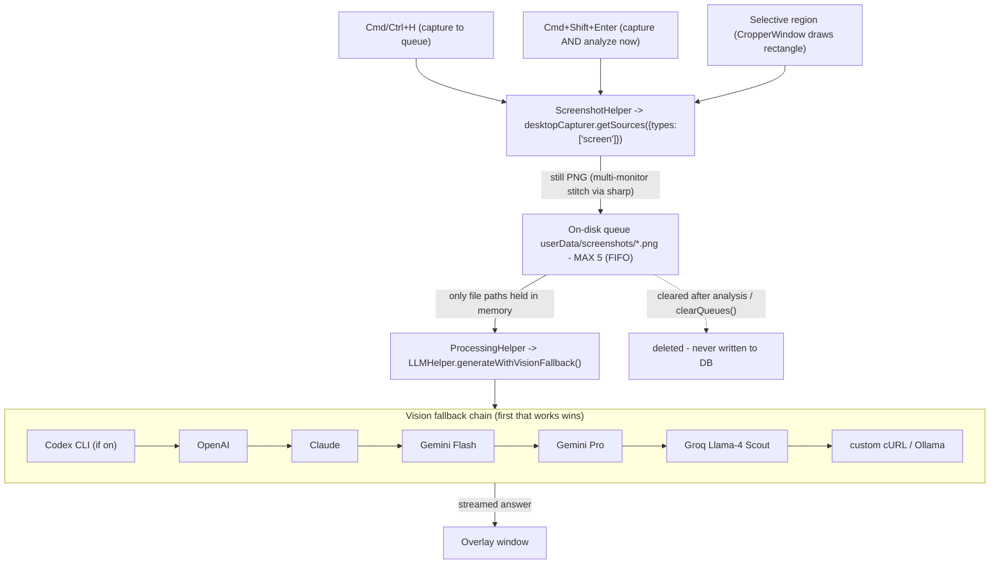

## 5. Live intelligence pipeline

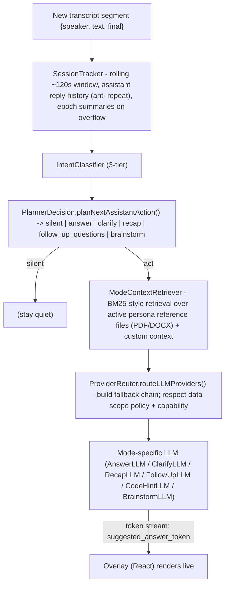

## 6. Intent classifier (3-tier)

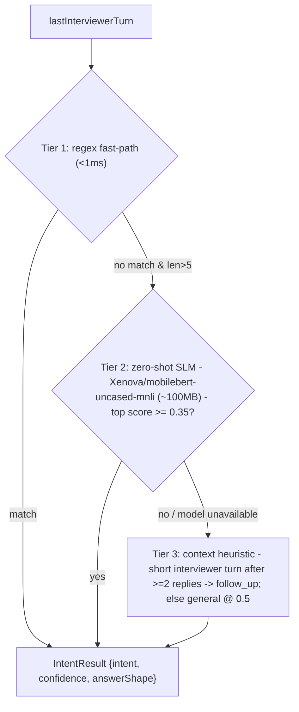

## 7. Planner decision tree

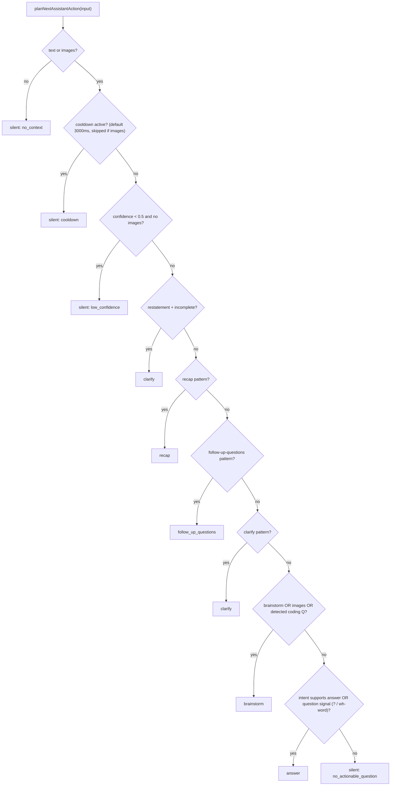

## 8. RAG / persistence lifecycle

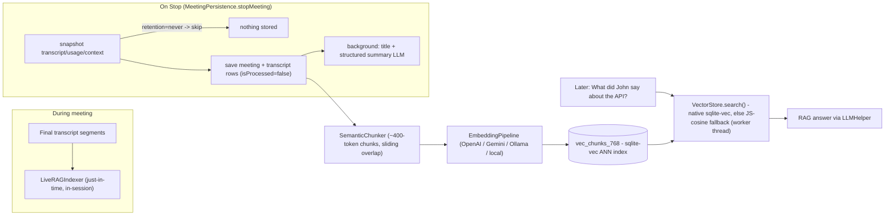

## 9. Sequence: live question

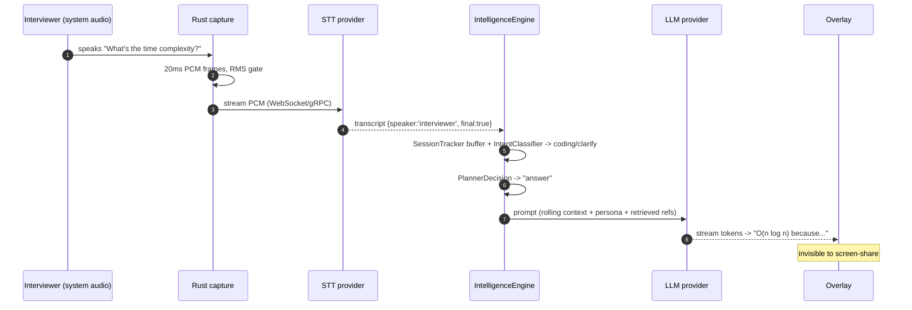

## 10. Sequence: screenshot

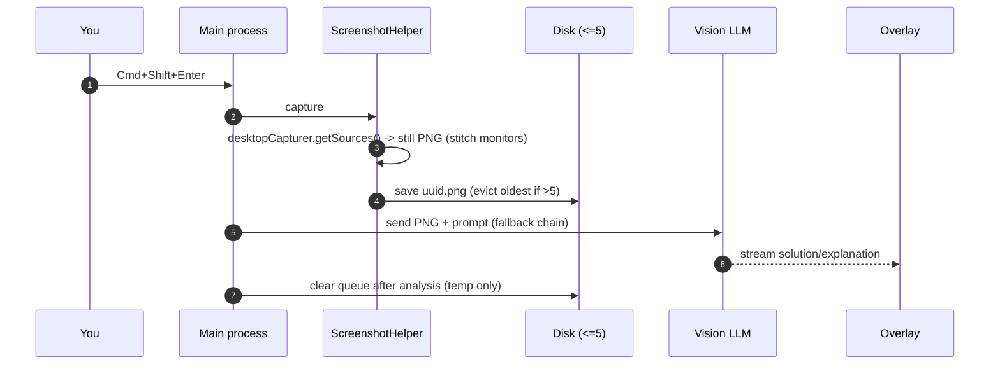

## 11. Run this repo as-is

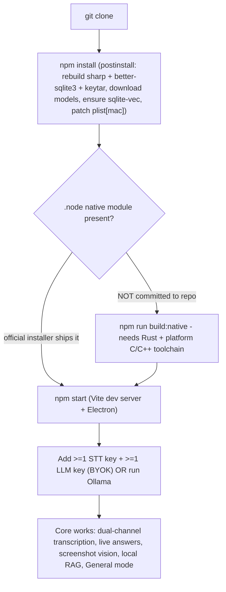

## 12. Operator: audio-silent triage

```mermaid
flowchart TD
    A["Audio silent / not transcribing"] --> B{STT status pill?}
    B -->|"failed"| F["Provider gave up: auth/quota/max-retries. Verify API key + quota; switch provider; restart"]
    B -->|"reconnecting"| R["Socket drops, backing off. Check network/DNS/VPN; self-recovers after 5s stable"]
    B -->|"connected, but no text"| G{Level bars moving? (Settings->Audio)}
    B -->|"awaiting-audio (stuck)"| C{Which channel is dead?}
    C -->|"mic / user"| MIC["Mic muted at OS or wrong device. Win: Settings->Privacy->Microphone. mac: re-grant Microphone"]
    C -->|"system / interviewer"| SYS{Banner text?}
    SYS -->|"screen-recording-revoked-rebuild (mac)"| TCC["macOS TCC broke after update (cdhash). Screen Recording: toggle Natively OFF/ON, restart"]
    SYS -->|"system-audio-permission-denied"| PERM["Screen Recording never granted (mac). Windows has no such permission"]
    SYS -->|"system-audio-stuck (~12s no chunks)"| STUCK["Output device changed (AirPods/HFP/BlackHole/HDMI). App rebuilds capture; re-select output or restart"]
    SYS -->|"no banner, just silence"| NONE["STT provider = none (silent-null) or key missing. Settings->Audio: confirm provider + key"]
    G -->|no| NATIVE{Native module loaded?}
    G -->|yes| NONE
    NATIVE -->|"dev build / no .node"| NB["loadNativeModule()=null -> empty device list. Run npm run build:native or reinstall official app"]
    NATIVE -->|loaded| NONE
```
